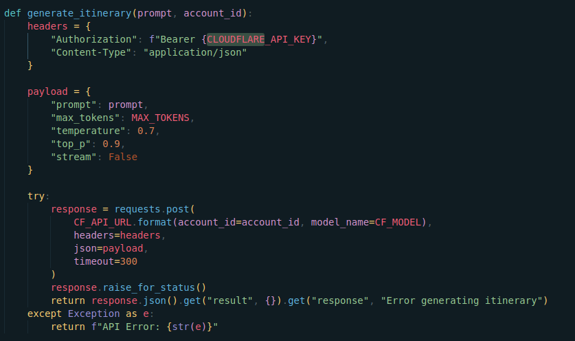
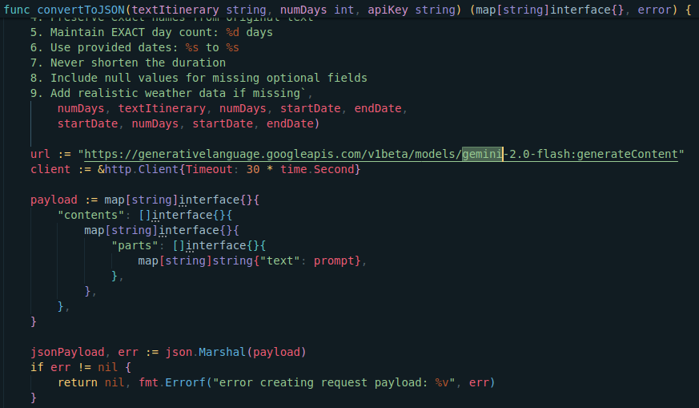

<div style="text-align: center;">  </div>

<div style="text-align: center;">   </div>

# Travel Buddy

Travel Buddy is a travel planning application that uses advanced AI, geolocation, and weather data to generate personalized travel itineraries. It leverages multiple APIs including Mapbox, TomTom, Open-Meteo, Cloudflare AI, and Gemini to provide a comprehensive travel planning experience.

## Table of Contents

- [Overview](#overview)
- [Folder Structure](#folder-structure)
- [Features](#features)
- [Installation](#installation)
- [Usage](#usage)
- [Contributing](#contributing)
- [License](#license)

## Overview

Travel Buddy helps users plan their trips by automatically generating detailed itineraries based on the destination, user preferences, and duration. The project integrates:
- **Geolocation APIs:** Retrieve location coordinates and points of interest.
- **Weather Data:** Get current weather and forecast information.
- **AI-Powered Itinerary Generation:** Uses Cloudflare AI and Gemini to generate travel itineraries and convert them into structured JSON.
- **Risk Analysis:** Evaluates travel risks based on weather conditions.

## Folder Structure

```
/ai-model    # Contains generative AI model configuration and related scripts
/backend     # Golang backend code that integrates with various APIs and generates itineraries
/frontend    # Frontend code (React, Vue, etc.) for the user interface of Travel Buddy
```

- **/ai-model:**  
  Contains the AI model code and configuration used for itinerary conversion, fetching coordinates, points of interest, weather data, risk analysis, and interacting with Cloudflare AI and Gemini APIs.

- **/backend:**  
  Implements the core logic in Golang. Includes all the hanlders and endpoints
  to database.

- **/frontend:**  
  Hosts the client-side code for the Travel Buddy application. This part of the project manages user interactions and displays the generated itineraries.

## Features

- **Personalized Itinerary Generation:**  
  Generate detailed, multi-day travel itineraries based on destination and user preferences.

- **Integration with Multiple APIs:**  
  Leverages Mapbox for geolocation, TomTom for POI data, and Open-Meteo for weather data.

- **AI-Powered Content Creation:**  
  Uses Cloudflare AI and Gemini to produce and convert itineraries into structured JSON.

- **Travel Risk Analysis:**  
  Calculates a risk factor based on weather conditions to provide safety recommendations.

## Track Prizes

In this app form track prizes we have  used Gemini API and Cloudflare Workers AI to process geolocation, weather, price tracking, and other travel-related data to produce detailed AI plans.

### 1. ClouFlare's Workers AI
  **It has been used specifically in AI Plan generation, we have extended capabilities of mistral-7b model to generate a personalized travel itinerary**
  `ai-model/model`

   

### 2. Gemini API
  **Gemini has has been used to sanatize the response of cloudflare's worker AI. The plan generated is not in ideal format so we have leveraged working of gemini to give it a proper structure and send as a reponse to our app.**

   


## Installation

1. **Clone the Repository:**
   ```bash
   git clone https://github.com/ErebusAJ/nith-yatra-bandhu.git
   cd nith-yatra-bandhu
   ```

2. **Backend Setup:**
   - Navigate to the `/backend` folder.
   - Ensure you have Go installed (version 1.20+ recommended).
   - Set up your environment variables for Cloudflare, Mapbox, TomTom, and Gemini API keys.
   - Install the packages:
     ```bash
     go mod download && go mod verify
     ```
   - Build the backend:
     ```bash
     go build -o cmd/main.go .
     ```

3. **Frontend Setup:**
   - Navigate to the `/frontend` folder.
   - Install dependencies (for example, if using React):
     ```bash
     npm install
     ```
   - Start the development server:
     ```bash
     npm start
     ```

4. **AI-Model Setup:**
   - Navigate to the `/ai-model` folder.
   - Follow the README or documentation in that folder to configure and run the AI model.

## Usage

After installation, start the backend and frontend services. The backend exposes endpoints to generate itineraries based on user input. The frontend provides a user-friendly interface to enter travel details and view the generated itinerary.

Example API call from the frontend:
```bash
POST /auth/ai-planner
{
  "location": "Rome, Italy",
  "user_query": "Cultural Viewpoints",
  "num_days": 5
}
```

The backend will process the request by:
1. Retrieving geolocation and POI data.
2. Fetching weather and calculating risk factors.
3. Generating a detailed itinerary using Cloudflare AI.
4. Converting the itinerary to a structured JSON using Gemini.

## Test Screenshots of our app

  


## Contributing

Contributions are welcome! Please follow these steps:
1. Fork the repository.
2. Create your feature branch: `git checkout -b feature/YourFeature`
3. Commit your changes: `git commit -m 'Add some feature'`
4. Push to the branch: `git push origin feature/YourFeature`
5. Open a pull request.

## License

This project is licensed under the MIT License. See the [LICENSE](LICENSE) file for details.

---

Feel free to adjust this README to fit your project's specifics and style guidelines.